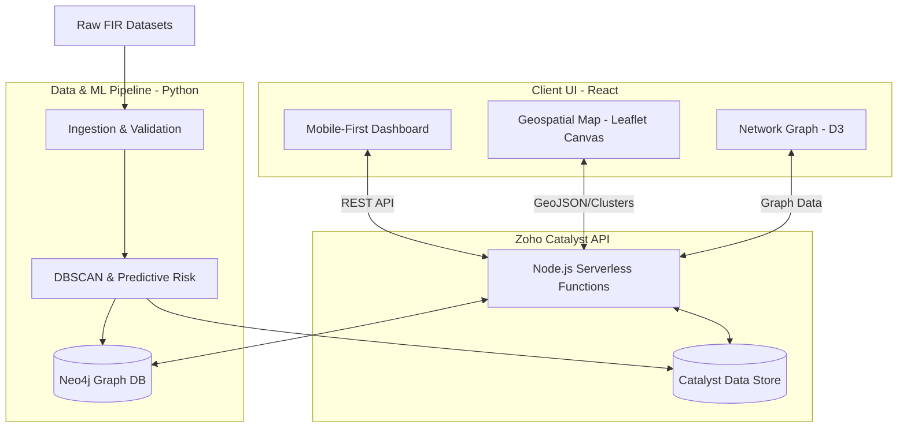
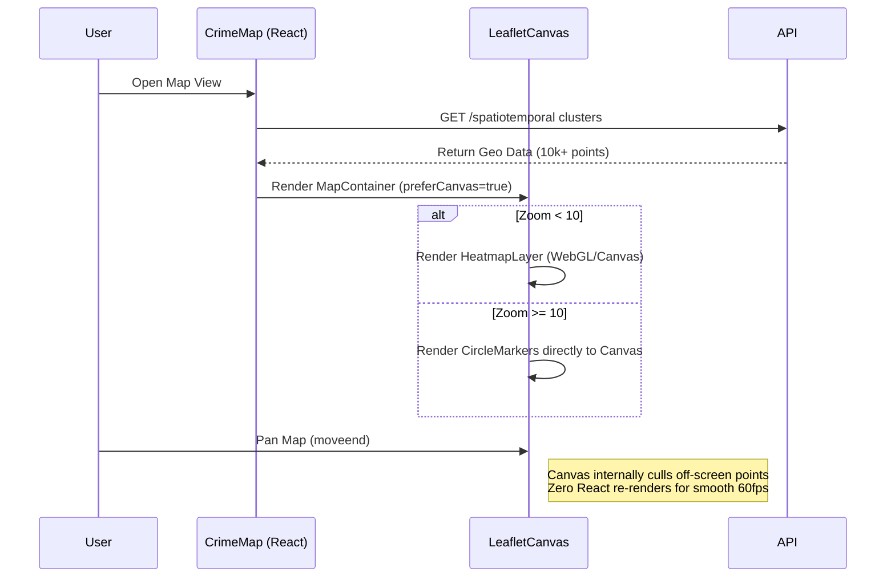
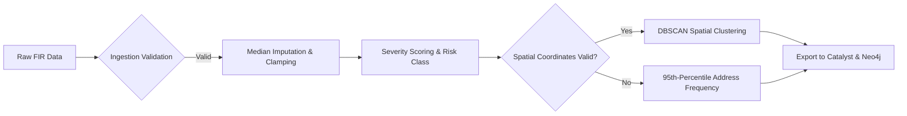

# 404 Detectives - Datathon

<div align="center">
  
</div>

## Problem Statement

The **Karnataka State Police (KSP)** currently manages crime data through fragmented, manual, and Excel-based systems, resulting in isolated records and limited analytical capability. This siloed approach restricts the ability to perform integrated, state-wide analysis and prevents the discovery of deeper criminal patterns, networks, and trends.

As a result, policing remains largely **reactive** rather than proactive, with minimal use of advanced analytics or AI to support decision-making. The **State Crime Records Bureau (SCRB)** lacks tools for real-time visualization, predictive insights, and network-based crime intelligence, making it difficult to identify hotspots, track repeat offenders, or uncover hidden associations between cases.

There is a critical need for an intelligent, AI-driven platform that integrates crime data across jurisdictions and enables advanced analytics, geospatial visualization, network analysis, and predictive modeling to support proactive and evidence-based policing.

## Solution: CrimeDNA

<div align="center">
  
  <p><i>Fig 1: CrimeDNA Workflow Diagram</i></p>
</div>

CrimeDNA is an AI-powered Crime Intelligence Platform that unifies crime data from multiple police sources and transforms it into a living behavioral intelligence network. Instead of treating each FIR or case as an isolated record, the platform analyzes behavioral patterns, modus operandi, locations, timelines, and relationships to create a unique "Crime DNA" for every incident. 

### Multi-Layer Filtering Engine & Intelligence
CrimeDNA features a dynamic, non-destructive **Filtering Engine** that powers our intelligence:
1. **Ingestion Validation**: Prevents data loss via median-imputation and mathematical clamping rather than destructive row-dropping.
2. **Predictive Risk Classification**: Computes a robust `Severity_Score` weighted heavily by IPC codes (e.g. Murder, NDPS, POCSO) and victim multipliers to generate a `Predicted_Risk_Class`.
3. **Hybrid Spatial Hotspot Detection**: Automatically executes **DBSCAN Spatial Clustering** on valid coordinate data. If coordinates are corrupted, it gracefully falls back to a strict 95th-percentile statistical frequency thresholding on localized address strings to flag true `Hotspot_Flag` instances.
4. **Graph Intelligence Mapping**: Pre-computes structural syndicate links (`Syndicate_Link_Flag`) to feed directly into Neo4j for network investigation.

## Recent UI/UX Enhancements (Mobile First)

- **Immersive Mobile Dashboards**: Rebuilt the `Trends`, `MobileDashboard`, `CrimeMap`, and `NetworkGraph` views with a mobile-first, glassmorphic aesthetic.
- **Geospatial & Network Visualization**: Upgraded the Crime Map to a fullscreen interactive layout using CartoDB Voyager tiles. Added an interactive physics-based, drag-and-drop network graph for relationship intelligence.
- **Premium Intelligence Preloader**: Implemented a global, theme-aware animated preloader (with KSP & CrimeDNA branding) that seamlessly manages route transitions with a cinematic 2.5s delay.
- **Aesthetic Overhauls**: Replaced hardcoded backgrounds with a global dotted radial-gradient pattern, fixed FAB shapes, added pill-shaped active navigation indicators, and vastly improved font legibility across charts.

## Dataset

The raw FIR data used in this project is sourced from Kaggle:
[FIR Details - Karnataka Police Dataset](https://www.kaggle.com/datasets/vanshangaria/fir-details-karnataka-police)

Please download the dataset and place the CSV files inside the `datasets/` directory before running the pipelines.

## Recent Performance Optimizations

- **Map Canvas Rendering**: Transitioned the Leaflet `DynamicCrimeLayer` from DOM-heavy SVG nodes to an optimized HTML5 Canvas (`preferCanvas={true}`). Removed expensive React-level `moveend` event listeners and manual bounds filtering. This allows Leaflet to natively cull off-screen points, bypassing expensive React VDOM diffing, resulting in buttery smooth 60fps panning even with tens of thousands of data points.

## Architecture & Design

### High Level Design (HLD)

The HLD illustrates the end-to-end data flow from raw FIR ingestion through the Python ML pipeline, into Zoho Catalyst, and finally served to the React Frontend.



### Low Level Design (LLD)

#### 1. Map Rendering Optimization Logic
This sequence diagram shows how the frontend map component optimizes the rendering of massive geospatial datasets.



#### 2. Multi-Layer Filtering Engine
This flowchart details the data processing pipeline's filtering and ML clustering logic.



## Enterprise File Structure (Zoho Catalyst & Data Pipeline)

```text
CrimeDNA/
├── client/                     # React Frontend (Mobile-First)
│   ├── public/                 # Static assets (KSP Logo, icons)
│   ├── src/                    
│   │   ├── api.ts              # Backend API Integration
│   │   ├── components/         # Reusable UI Components
│   │   │   ├── MobileHeader.tsx# Glassmorphic Dual-branded header
│   │   │   ├── Navbar.tsx      # Responsive Sidebar/Bottom Nav
│   │   │   ├── KpiCard.tsx     # Data Insight Cards
│   │   │   └── Preloader.tsx   # Cinematic Intelligence Preloader
│   │   ├── pages/              # Application Views
│   │   │   ├── MobileDashboard.tsx # Immersive Mobile Overview
│   │   │   ├── CrimeMap.tsx    # Fullscreen Spatial Intelligence (Leaflet)
│   │   │   ├── NetworkGraph.tsx# Interactive Physics Node Graph
│   │   │   ├── Trends.tsx      # Temporal Area Charts
│   │   │   ├── Alerts.tsx      # Severity-based live feed
│   │   │   └── FIRList.tsx     # Case Registry
│   │   ├── App.css & index.css # Global styling, Grid Patterns
│   │   └── utils.ts            # Helpers & Hooks
├── functions/                  # Zoho Catalyst Node.js Backend API
│   └── crime_dna/              
├── data_processing/            # Data Processing & ML Pipeline
│   ├── data/                   # Local data storage (ignored by git)
│   ├── datasets/               # The original FIR dataset files
│   ├── src/                    # Core ETL Source Code
│   ├── orchestration/          # Airflow/Prefect execution DAGs
│   ├── tests/                  # Unit tests for data transformations
│   ├── config/                 # Configuration files
│   └── requirements.txt
├── catalyst.json               # Catalyst deployment config
├── .catalystrc                 # Catalyst environment settings
└── README.md
```

## How to use

Run the comprehensive multi-layer filtering engine test (requires raw data in `data_processing/datasets/`):
```bash
cd data_processing
python orchestration/test_filters.py
```

Run the legacy ingestion test directly to SQLite:
```bash
cd data_processing
python src/loaders/test_ingestion.py
```

## Contributors 

1. Arnav Eluri - Reva University, Bengaluru - KA 
2. Aryan Keshri - Acharaya Institute of Technology, Bengaluru - KA
3. Ruhi Sharma - Reva University, Bengaluru - KA
4. Spandana S R - Reva University, Bengaluru - KA 
