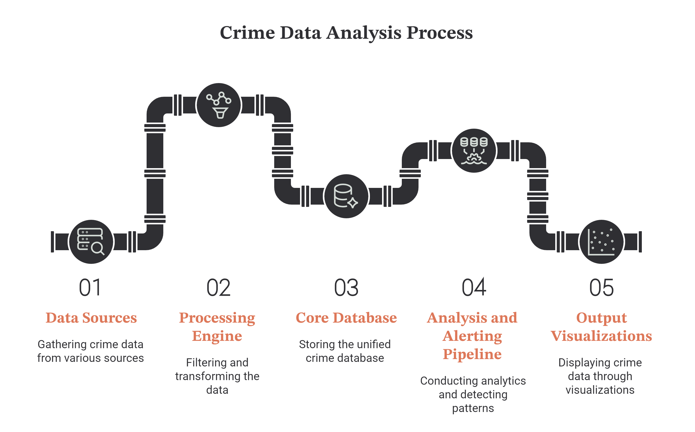
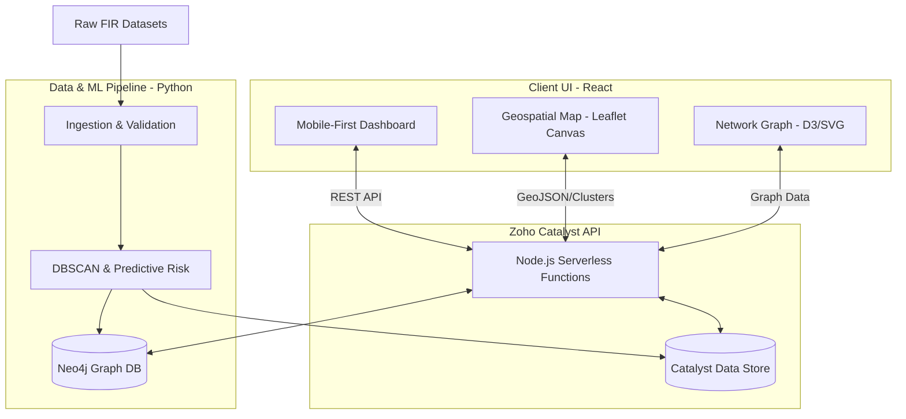
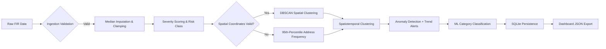
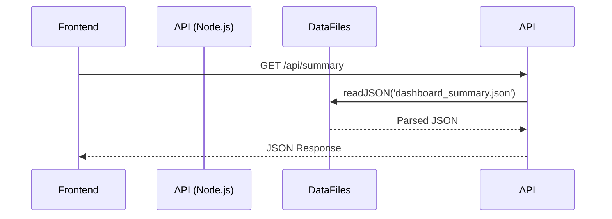

# Crime DNA 

<div align="center">
  
</div>

## Problem Statement

The **Karnataka State Police (KSP)** currently manages crime data through fragmented, manual, and Excel-based systems, resulting in isolated records and limited analytical capability. This siloed approach restricts the ability to perform integrated, state-wide analysis and prevents the discovery of deeper criminal patterns, networks, and trends.

As a result, policing remains largely **reactive** rather than proactive, with minimal use of advanced analytics or AI to support decision-making. The **State Crime Records Bureau (SCRB)** lacks tools for real-time visualization, predictive insights, and network-based crime intelligence, making it difficult to identify hotspots, track repeat offenders, or uncover hidden associations between cases.

There is a critical need for an intelligent, AI-driven platform that integrates crime data across jurisdictions and enables advanced analytics, geospatial visualization, network analysis, and predictive modeling to support proactive and evidence-based policing.

## Solution: CrimeDNA

<div align="center">
  
  <p><i>Fig 1: CrimeDNA Workflow Diagram</i>
</div>

CrimeDNA is an AI-powered Crime Intelligence Platform that unifies crime data from multiple police sources and transforms it into a living behavioral intelligence network. Instead of treating each FIR or case as an isolated record, the platform analyzes behavioral patterns, modus operandi, locations, timelines, and relationships to create a unique "Crime DNA" for every incident.

### Multi-Layer Filtering Engine & Intelligence

CrimeDNA features a dynamic, non-destructive **Filtering Engine** that powers our intelligence:

1. **Ingestion Validation**: Prevents data loss via median-imputation and mathematical clamping rather than destructive row-dropping.
2. **Predictive Risk Classification**: Computes a robust `Severity_Score` weighted heavily by IPC codes (e.g. Murder, NDPS, POCSO) and victim multipliers to generate a `Predicted_Risk_Class`.
3. **Hybrid Spatial Hotspot Detection**: Automatically executes **DBSCAN Spatial Clustering** on valid coordinate data. If coordinates are corrupted, it gracefully falls back to a strict 95th-percentile statistical frequency thresholding on localized address strings to flag true `Hotspot_Flag` instances.
4. **Graph Intelligence Mapping**: Pre-computes structural syndicate links (`Syndicate_Link_Flag`) to feed directly into Neo4j for network investigation.

### Spatiotemporal & Anomaly Intelligence

- **Spatiotemporal Clustering**: Groups crimes by district, time-of-day bucket, and rounded coordinates to detect repeat crime patterns at specific locations and times.
- **Anomaly Detection**: Uses Isolation Forest (for datasets with 10+ crime categories) or Z-score thresholding to flag statistically anomalous crime spikes.
- **Trend Alerts**: Compares recent 3-month crime counts against historical averages to generate CRITICAL/ELEVATED alerts for emerging trends.
- **Forecasting**: Linear regression trend extrapolation for the top 5 crime categories, projecting 6-month forward predictions.
- **Socioeconomic Correlation**: Maps crime rates against mock socioeconomic indicators (population density, literacy, urbanization) per district.

---

## Architecture

### High Level Design (HLD)



### Low Level Design (LLD)

#### 1. Data Pipeline Stages

The Python pipeline (`data_processing/`) executes 11 sequential stages:



#### 2. Map Rendering Optimization Logic


#### 3. Backend API Flow



---

## Dataset

The raw FIR data used in this project is sourced from Kaggle:
[FIR Details - Karnataka Police Dataset](https://www.kaggle.com/datasets/vanshangaria/fir-details-karnataka-police)

Please download the dataset and place the CSV files inside the `data_processing/datasets/` directory before running the pipelines.

---

## What Has Been Built

### 1. Data Processing & ML Pipeline (`data_processing/`)

A comprehensive Python pipeline with 11 stages:

| Stage | Component | Description |
|-------|-----------|-------------|
| 1 | `data_generation.py` | Generates mock FIR datasets for 3 police stations with 5 crime categories (Violent, Financial, Cyber, Property, Drug-related) |
| 2 | `data_processing.py` | Loads CSVs, aggregates datasets, trains TF-IDF + LogisticRegression classifier for crime categorization |
| 3 | `cleaner.py` | Non-destructive cleaning: deduplication, median imputation for missing coordinates (with district lookup table), string standardization, year/count clamping |
| 4 | `analytical_filters.py` | Time bucket generation, severity scoring (IPC-weighted + victim/accused multipliers), severity bucketing (LOW/HIGH/CRITICAL) |
| 5 | `graph_filters.py` | Syndicate link detection (3+ accused), location recurrence counting, modus operandi clustering |
| 6 | `ml_filters.py` | Historical archive flagging, noise flagging, DBSCAN hotspot labeling with statistical fallback, risk class mapping |
| 7 | `alert_generator.py` | Spatiotemporal clustering, Isolation Forest anomaly detection, trend-based alert generation, summary builders |
| 8 | `pipeline_orchestrator.py` | Orchestrates all stages, builds network/forecast/socioeconomic data, exports dashboard summaries |
| 9 | `main.py` | CLI entry point with argparse (`--run`, `--all`, `--generate-mock`, `--source`, `--limit`, `--no-analysis`, `--no-classification`) |
| 10 | `database_operations.py` | SQLAlchemy ORM models (Station, Fir, FilteredCrime) with SQLite persistence |
| 11 | `schema.sql` | Full police FIR database schema (26 tables) based on ER diagram |

**Key Features:**
- **Non-destructive filtering**: Never drops rows; uses imputation and flagging instead
- **District coordinate lookup**: 30+ Karnataka districts with lat/lng mappings for coordinate imputation
- **Hybrid hotspot detection**: DBSCAN clustering with 95th-percentile statistical fallback
- **Mock data generation**: 300 synthetic FIRs across 3 stations with realistic crime templates
- **Test suite**: `test_filters.py` with shape logging decorator for pipeline validation

### 2. Backend API (`functions/crime_dna/`)

A Node.js Express API deployed on Zoho Catalyst with 14 endpoints:

| Endpoint | Description |
|----------|-------------|
| `GET /` | Health check with version info |
| `GET /api/health` | System health with data availability status |
| `GET /api/summary` | Full dashboard summary (KPIs, distributions, alerts, clusters) |
| `GET /api/trends` | Monthly trends, crime type & district distributions |
| `GET /api/hotspots` | Hotspot count, spatiotemporal clusters, locations |
| `GET /api/severity` | Severity distribution, risk class distribution, critical count |
| `GET /api/offenders` | Syndicate link count, anomaly count, total FIRs |
| `GET /api/network` | Network graph nodes and edges |
| `GET /api/spatiotemporal` | Spatiotemporal cluster details |
| `GET /api/alerts` | Filterable alerts (by district, alert level) |
| `GET /api/anomalies` | Anomaly count, rate, total FIRs |
| `GET /api/forecast` | Crime category forecasts with historical data |
| `GET /api/associations` | Syndicate links, network nodes/edges |
| `GET /api/socioeconomic` | District-level socioeconomic indicators |
| `GET /api/firs` | Paginated, filterable FIR records |
| `GET /api/firs/:id` | Single FIR detail with linked entities |

**Services:**
- `chat.service.js` - Chatbot service for querying dashboard data
- `stt.service.js` - Speech-to-text service (placeholder for future integration)
- `response.service.js` - Response formatting service (placeholder)

### 3. Frontend Dashboard (`client/`)

A mobile-first React dashboard with TypeScript and Vite:

| Page | Features |
|------|----------|
| **Dashboard** | KPI cards (7 metrics), crime category bar chart, risk class pie chart, responsive layout with mobile fallback |
| **Crime Map** | Fullscreen Leaflet map with CartoDB Voyager tiles, heatmap layer (zoom < 10), native canvas markers (zoom >= 10), severity-colored popups, spatiotemporal cluster visualization |
| **Network Graph** | Interactive SVG physics-based force graph with drag-and-drop, hover highlighting, node grouping (crime type/district/syndicate), crime linkage card overlay |
| **Trends** | Monthly FIR trend line chart (24 months), crime type distribution bar chart, district comparison chart |
| **Alerts** | Filterable alert cards (CRITICAL/ELEVATED/NORMAL), district chips, trend indicators with percentage change |
| **Severity** | KPI cards, severity bar chart, severity pie chart, ML-based risk class distribution |
| **FIR Records** | Paginated table with search, crime type/severity filters, sortable columns |

**Components:**
- `Preloader.tsx` - Cinematic 2.5s preloader with KSP & CrimeDNA branding, floating animation, scan bar
- `Navbar.tsx` - Desktop sidebar + mobile bottom navigation with bilingual toggle (English/Kannada)
- `MobileHeader.tsx` - Mobile header with language toggle and project info drawer
- `KpiCard.tsx` - Animated KPI card with icon, gradient background, glassmorphism
- `AlertCard.tsx` - Alert card with severity badge, trend direction, historical average

**UI/UX Features:**
- Glassmorphic design with backdrop blur
- Global dotted radial-gradient background pattern
- CSS variables for theming (Material 3 color scheme)
- Responsive breakpoints (768px mobile threshold)
- SVG icons with inline React components
- Custom scrollbar styling
- CSS animations (pulse, float, scan-bar, blink)

### 4. Configuration & Deployment

- `catalyst.json` - Zoho Catalyst deployment config (functions + client build)
- `.catalystrc` - Catalyst project/environment settings (CrimeDNA project, Development env)
- `requirements.txt` - Python dependencies (pandas, scikit-learn, sqlalchemy, numpy, scipy)
- `package.json` - Node.js dependencies (express, zcatalyst-sdk-node)
- Vite config with TypeScript, React plugin, canvas rendering

---

## Enterprise File Structure

```text
CrimeDNA/
├── client/                     # React Frontend (Mobile-First, TypeScript)
│   ├── public/                 # Static assets (KSP Logo, icons, favicon)
│   ├── src/
│   │   ├── api.ts              # Backend API Integration (14 endpoints)
│   │   ├── App.tsx             # React Router setup (7 routes)
│   │   ├── App.css             # Global styles, sidebar, responsive nav
│   │   ├── index.css           # CSS variables, typography, glassmorphism
│   │   ├── index.tsx           # React root entry
│   │   ├── types.ts            # TypeScript interfaces (10 types)
│   │   ├── utils.ts            # Helpers: crime/district formatting, media query hook
│   │   ├── components/         # Reusable UI Components
│   │   │   ├── Preloader.tsx   # Cinematic intelligence preloader
│   │   │   ├── Navbar.tsx      # Desktop sidebar + mobile bottom nav
│   │   │   ├── MobileHeader.tsx# Mobile header with language toggle
│   │   │   ├── KpiCard.tsx     # Animated KPI metric card
│   │   │   └── AlertCard.tsx   # Severity alert card with trend
│   │   └── pages/              # Application Views (7 pages)
│   │       ├── Dashboard.tsx   # Desktop dashboard with charts
│   │       ├── MobileDashboard.tsx # Mobile-optimized dashboard
│   │       ├── CrimeMap.tsx    # Fullscreen Leaflet map with heatmap
│   │       ├── NetworkGraph.tsx# SVG physics-based network graph
│   │       ├── Trends.tsx      # Temporal trend analysis charts
│   │       ├── Alerts.tsx      # Filterable alert feed
│   │       ├── Severity.tsx    # Severity & risk analysis
│   │       └── FIRList.tsx     # Paginated FIR registry
│   ├── vite.config.ts          # Vite + React plugin config
│   ├── tsconfig.json           # TypeScript configuration
│   ├── package.json            # Dependencies & scripts
│   └── build/                  # Production build output
├── functions/                  # Zoho Catalyst Node.js Backend API
│   └── crime_dna/
│       ├── index.js            # Express server with 14 REST endpoints
│       ├── package.json        # Dependencies (express, zcatalyst-sdk)
│       ├── catalyst-config.json# Catalyst function config
│       ├── data/               # Pipeline output JSON files
│       │   ├── dashboard_summary.json
│       │   ├── network_data.json
│       │   ├── forecast_data.json
│       │   └── socioeconomic_data.json
│       └── services/           # Service modules
│           ├── chat.service.js # Chatbot data query service
│           ├── stt.service.js  # Speech-to-text service (placeholder)
│           └── response.service.js # Response formatting (placeholder)
├── data_processing/            # Data Processing & ML Pipeline (Python)
│   ├── orchestration/          # Pipeline orchestration & CLI
│   │   ├── main.py             # CLI entry point (argparse)
│   │   ├── pipeline_orchestrator.py # 11-stage pipeline orchestrator
│   │   └── test_filters.py     # Multi-layer filter test suite
│   ├── src/
│   │   ├── ingestion/          # Data ingestion & cleaning
│   │   │   ├── cleaner.py      # Non-destructive cleaning (imputation, clamping)
│   │   │   ├── validator.py    # (Placeholder)
│   │   │   ├── deduplicator.py # (Placeholder)
│   │   │   └── filtering/      # Filtering sub-package
│   │   │       ├── data_processing.py  # CSV loading, aggregation, ML classification
│   │   │       ├── data_generation.py  # Mock FIR data generator
│   │   │       ├── database_operations.py # SQLAlchemy ORM models & CRUD
│   │   │       └── config.py   # Configuration (paths, stations, categories)
│   │   ├── features/           # Feature engineering & ML
│   │   │   ├── analytical_filters.py  # Severity scoring, time buckets
│   │   │   ├── graph_filters.py       # Syndicate links, location recurrence
│   │   │   ├── ml_filters.py          # DBSCAN, hotspot/risk labeling
│   │   │   ├── alert_generator.py     # Spatiotemporal, anomaly, trend alerts
│   │   │   └── graph_builder.py       # (Empty - planned)
│   │   ├── loaders/            # Database loaders
│   │   │   ├── schema.sql      # 26-table police FIR schema
│   │   │   ├── sqlite_loader.py # (Empty - planned)
│   │   │   ├── neo4j_loader.py  # (Empty - planned)
│   │   │   └── test_ingestion.py # SQLite ingestion test script
│   │   └── utils/
│   │       ├── filter_engine.py       # Dynamic multi-layer filter engine
│   │       └── dashboard_filters.py   # Operational dashboard query filters
│   ├── requirements.txt        # Python dependencies
│   └── data/                   # Pipeline output (gitignored)
│       ├── crime_pipeline.db   # SQLite database
│       ├── 02_staging/         # Staging data
│       └── 03_processed/       # Processed JSON outputs
├── docs/                       # Project documentation
│   ├── aryan_keshri_todo.md    # PDF dossier export feature spec
│   └── ruhi_sharma_todo.md     # Bilingual voice chatbot feature spec
├── images/                     # Project images & diagrams
│   ├── ksp_logo.jpeg           # Karnataka State Police logo
│   ├── flowchart.png           # CrimeDNA workflow diagram
│   └── img-1.png through img-7.png # Dashboard icons
├── catalyst.json               # Zoho Catalyst deployment config
├── .catalystrc                 # Catalyst environment settings
├── Police_FIR_ER_Diagram.pdf   # Entity Relationship diagram
├── .gitignore
└── README.md
```

---

## How to Use

### Prerequisites

- Python 3.10+ with pip
- Node.js 18+ with npm
- Zoho Catalyst CLI (for deployment)
- Kaggle FIR dataset (download from the link above)

### 1. Set Up Python Pipeline

```bash
cd data_processing
pip install -r requirements.txt
```

### 2. Run the Pipeline (Mock Data)

```bash
cd data_processing
python orchestration/main.py --all
```

### 3. Run the Pipeline (Real Data)

```bash
cd data_processing
# Place FIR_Details_Data.csv in datasets/
python orchestration/main.py --run --source real --limit 50000
```

### 4. Run the Filter Test Suite

```bash
cd data_processing
python orchestration/test_filters.py
```

### 5. Run the Legacy SQLite Ingestion Test

```bash
cd data_processing
python src/loaders/test_ingestion.py
```

### 6. Start the Frontend & Backend (Development)

```bash
# Terminal 1: Start the API server
cd functions/crime_dna
node index.js

# Terminal 2: Start the React dev server
cd client
npm run dev
```

### 7. Build for Production

```bash
cd client
npm run build
```

### CLI Options

```
python orchestration/main.py --help

Options:
  --run              Run the full intelligence pipeline
  --all              Generate mock data and run the full pipeline
  --generate-mock    Generate mock FIR CSV datasets only
  --source [real|mock]  Data source (default: real)
  --limit N          Number of rows to load from real dataset
  --no-analysis      Skip analytical, graph, ML, and alert layers
  --no-classification  Skip ML category classification
```

---

## Performance Optimizations

- **Map Canvas Rendering**: Leaflet `DynamicCrimeLayer` uses `preferCanvas={true}` to render via HTML5 Canvas instead of DOM-heavy SVG nodes. Removed expensive React-level `moveend` event listeners, allowing Leaflet to natively cull off-screen points for 60fps panning with tens of thousands of data points.
- **Network Graph**: Custom SVG physics simulation with requestAnimationFrame, avoiding heavy D3 library overhead while maintaining interactive drag-and-drop.
- **Preloader**: Cinematic 2.5s delay with floating animation and scan bar, ensuring smooth route transitions without layout shift.

---

## Future Work

### 1. Standardized Dossier Export (PDF Generation)
**Assigned to: Aryan Keshri**
- One-click PDF export from map popups and data tables
- Map snapshotting via html2canvas
- Standardized intelligence report layout
- Client-side generation using jspdf + html2canvas
- See `docs/aryan_keshri_todo.md` for full specification

### 2. Bilingual Voice-Based Data Analytics Chatbot
**Assigned to: Ruhi Sharma**
- Speech-to-Text (Whisper/Google STT) for Kannada & English
- Text-to-Speech (Google/Azure TTS) with Kannada support
- LangChain SQL agent for natural language database querying
- Bilingual response generation (Kannada/English)
- See `docs/ruhi_sharma_todo.md` for full specification

---

## Contributors

1. **Arnav Eluri** - Reva University, Bengaluru, KA
   - Python data pipeline architecture, ML feature engineering, orchestration
2. **Aryan Keshri** - Acharaya Institute of Technology, Bengaluru, KA
   - Frontend React dashboard, network graph visualization, PDF export planning
3. **Ruhi Sharma** - Reva University, Bengaluru, KA
   - Backend API design, voice chatbot architecture planning
4. **Spandana S R** - Reva University, Bengaluru, KA
   - Data ingestion, cleaning, and validation logic
