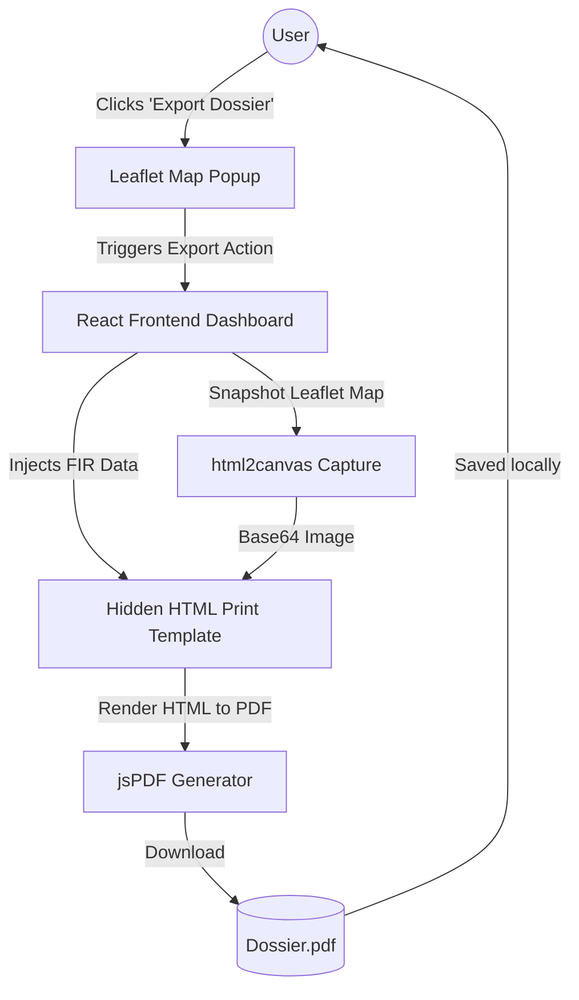
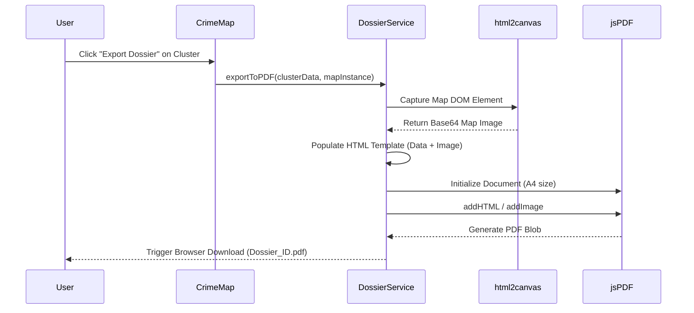

# Standardized Dossier Export (PDF Generation)

## Problem Statement
Intelligence officers and detectives need a way to easily extract, format, and share critical case information discovered within the CrimeDNA platform. Currently, the data only exists within the web dashboard. There is a critical need to export specific crime clusters and FIR details into a standardized, legally presentable physical or digital dossier (e.g., an Interpol Case Summary or a Prosecutor Dossier) to hand over to courts or external agencies.

## Proposed Solution
Build a "Generate Dossier" module integrated directly into the geospatial map and data tables. When a user clicks on a crime cluster or an FIR, they can trigger an export. The frontend will dynamically compile the FIR details, severity scoring, network linkages, and a visual snapshot of the map location into a cleanly formatted, downloadable PDF document.

## Requirements

### Functional Requirements
- **One-Click Export**: Users should be able to click an "Export Dossier" button from a map popup or a data table.
- **Map Snapshotting**: The PDF must include a visual screenshot/render of the Leaflet map showing the exact geographic location of the crime cluster.
- **Structured Layout**: The PDF must follow a standardized intelligence report layout (Headers, Logos, Suspect Info, Timestamp, Severity Badge).
- **Offline Generation**: The PDF generation should ideally happen on the client-side to save backend bandwidth and ensure privacy.

### Technical Requirements
- **Frontend Framework**: React.js within the existing `client/` folder.
- **PDF Library**: `jspdf` and `html2canvas` (or `react-pdf`) for client-side document rendering.
- **Map Rendering**: `leaflet-image` or `html2canvas` to capture the DOM state of the map.
- **Styling**: Standard CSS / inline styling for the hidden print layout.

---

## Architecture & Diagrams

### High Level Design (HLD)



### Low Level Design (LLD)



---

## Data Pipeline

1. **Trigger**: User selects a `SpatiotemporalCluster` from the UI.
2. **Data Assembly**: The React component gathers the `severity_level`, `frequency`, `crime_categories`, and coordinates.
3. **Visual Capture**: The system temporarily freezes the Leaflet map state and uses a canvas tool to snap a picture of the current viewport.
4. **Template Injection**: The assembled JSON data and the base64 map image are injected into a structured JSX/HTML template that matches international reporting standards.
5. **PDF Compilation**: The `jsPDF` library parses the DOM template and writes it to a binary PDF format.
6. **Delivery**: The browser triggers a local file download, requiring zero backend interaction.

---

## Step-by-Step Approach

1. **Phase 1: Library Integration & UI**
   - Install `jspdf` and `html2canvas` in the `client/` directory.
   - Add an "Export Dossier" button to the existing Leaflet `<Popup>` inside `CrimeMap.tsx`.
2. **Phase 2: The Print Template**
   - Create a new React component (e.g., `DossierTemplate.tsx`) that acts as the visual layout for the PDF. It should include the KSP logo, standard headers, and data tables. This component can be rendered off-screen.
3. **Phase 3: Map Snapshotting**
   - Implement logic to capture the Leaflet map element. (Note: Leaflet canvas rendering `preferCanvas={true}` makes capturing via `html2canvas` much easier).
4. **Phase 4: PDF Generation & Download**
   - Wire the button click to populate the template, run the canvas capture, initialize `jsPDF`, append the content, and trigger the `pdf.save('Case_Dossier.pdf')` method.

---

## Code Structure

```text
CrimeDNA/
├── client/                     # Existing React Frontend
│   ├── src/
│   │   ├── components/
│   │   │   └── exports/
│   │   │       ├── DossierTemplate.tsx   # The layout for the PDF
│   │   │       └── ExportButton.tsx      # The UI trigger button
│   │   ├── utils/
│   │   │   └── pdfGenerator.ts           # Logic combining jsPDF and html2canvas
│   │   └── pages/
│   │       └── CrimeMap.tsx              # Updated with Export Button inside Popup
```

---

## Sample Code Snippets

To help you get started quickly, here is a structural snippet showing how to combine `html2canvas` and `jsPDF`.

### PDF Generation Utility (React Frontend)
Use this utility function to convert a React DOM reference into a downloadable PDF.

```typescript
import jsPDF from 'jspdf';
import html2canvas from 'html2canvas';

/**
 * Captures a DOM element and exports it as an A4 PDF.
 * @param elementId The HTML ID of the hidden dossier template.
 * @param filename The desired output filename.
 */
export const generatePdfFromDom = async (elementId: string, filename: string) => {
  const element = document.getElementById(elementId);
  if (!element) return;

  try {
    // 1. Capture the DOM element as an image
    const canvas = await html2canvas(element, { 
        scale: 2, // Higher scale for better PDF print quality
        useCORS: true // Required if map tiles are external
    });
    const imgData = canvas.toDataURL('image/png');

    // 2. Initialize an A4 sized PDF
    const pdf = new jsPDF({
      orientation: 'portrait',
      unit: 'mm',
      format: 'a4'
    });

    // 3. Calculate dimensions to fit the A4 page
    const pdfWidth = pdf.internal.pageSize.getWidth();
    const pdfHeight = (canvas.height * pdfWidth) / canvas.width;

    // 4. Add the image to the PDF and trigger download
    pdf.addImage(imgData, 'PNG', 0, 0, pdfWidth, pdfHeight);
    pdf.save(`${filename}.pdf`);
    
  } catch (error) {
    console.error("Failed to generate dossier PDF:", error);
  }
};
```

---

**Assigned to: Aryan Keshri**
