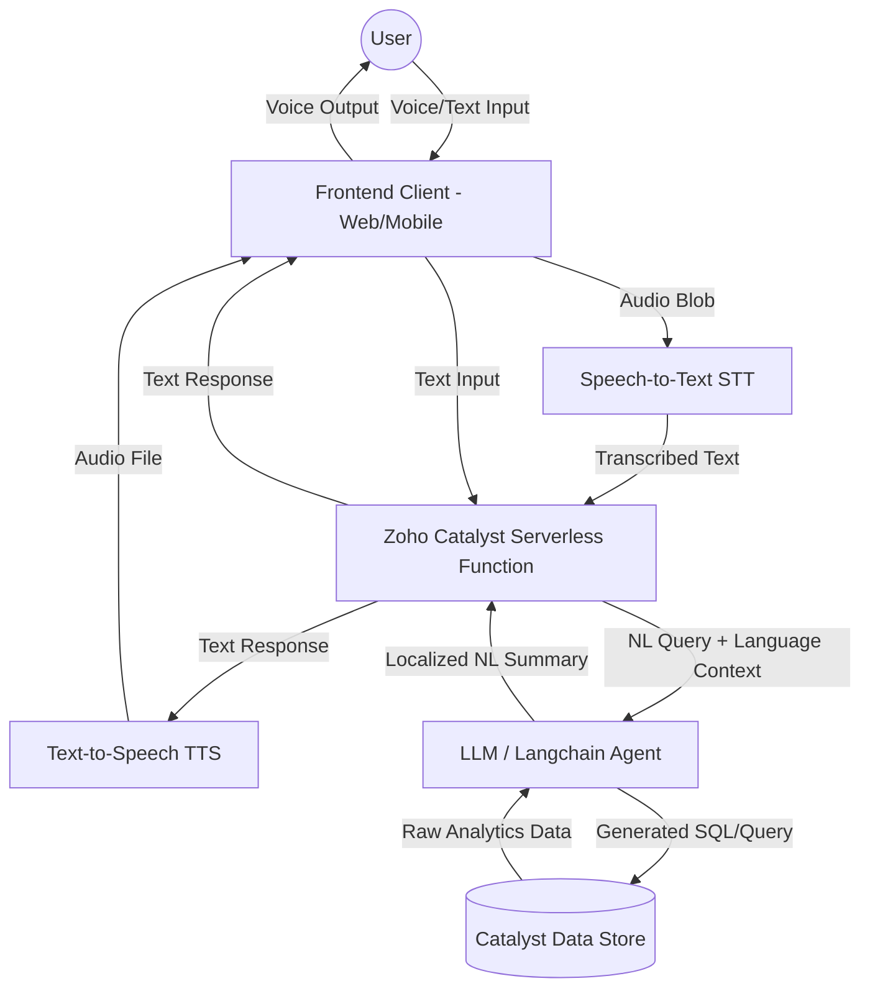
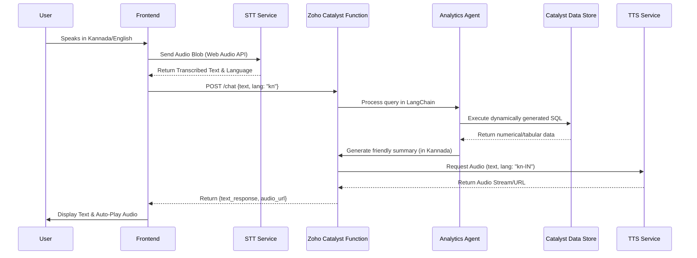

# Bilingual Voice-Based Data Analytics Chatbot

## Problem Statement
Users need an intuitive, accessible way to query data analytics without writing code or navigating complex dashboards. The solution must support both voice and text interactions and cater to a bilingual audience (Kannada and English). Crucially, the system must understand queries in either language, fetch the relevant analytical data, and respond back in the selected language in both text and synthesized voice.

## Proposed Solution
An AI-powered conversational agent that leverages Speech-to-Text (STT) for audio ingestion, a Large Language Model (LLM) equipped with Data Analytics agents (Text-to-SQL) to query databases, and Text-to-Speech (TTS) to vocalize the insights back to the user in Kannada or English.

## Requirements

### Functional Requirements
- **Bilingual Support**: Seamlessly detect, process, and respond in Kannada and English.
- **Multimodal I/O**: Accept both Voice and Text inputs; deliver both Voice and Text outputs.
- **Analytics Engine**: Natural language querying of a SQL/NoSQL analytics database.
- **Context Awareness**: Maintain chat history for follow-up data questions.

### Technical Requirements
- **Frontend**: React.js within the existing `client/` folder.
- **Backend**: Zoho Catalyst Serverless Functions (Node.js/Python) within the existing `functions/` folder.
- **Speech-to-Text (STT)**: OpenAI Whisper, Google Cloud Speech-to-Text, or Azure Speech Services.
- **Text-to-Speech (TTS)**: Google Cloud TTS, Azure TTS, or ElevenLabs (with Kannada support).
- **LLM / Analytics Engine**: LangChain / LlamaIndex integration inside Catalyst functions.
- **Database**: Existing Zoho Catalyst Data Store / Neo4j Database.

---

## Architecture & Diagrams

### High Level Design (HLD)



### Low Level Design (LLD)



---

## Data Pipeline

1. **Ingestion**: User audio is recorded via the browser's `MediaRecorder API` and sent as a Blob.
2. **Transcription**: Whisper or Google STT transcribes the audio into text and identifies the language.
3. **Intent & SQL Generation**: LangChain passes the text to an LLM, which translates the intent into a SQL query mapped to the database schema.
4. **Execution**: The query runs against the data warehouse to fetch live metrics.
5. **Synthesis**: The LLM takes the raw data (e.g., `{"sales": 5000}`) and formats it into a conversational sentence in the requested language (e.g., "ಒಟ್ಟು ಮಾರಾಟ 5000 ಆಗಿದೆ").
6. **Vocalization**: The TTS service converts the translated summary sentence into an audio file for playback.

---

## Step-by-Step Approach

1. **Phase 1: Environment & Integration**
   - Integrate the Voice Chat UI into the existing React `client/`.
   - Set up the Zoho Catalyst Advanced I/O function in `functions/`.
   - Ensure connection to the existing Zoho Catalyst Data Store schemas.
2. **Phase 2: Text-Based Analytics Agent**
   - Integrate LangChain `create_sql_agent` to answer text queries against the DB in English.
   - Update the LLM system prompt to enforce bilingual responses based on user input language.
3. **Phase 3: Voice Integration**
   - Add microphone permissions and Web Audio recording to the frontend.
   - Connect the STT API to transcribe Kannada/English audio into text.
   - Connect the TTS API to synthesize the LLM's response into downloadable/streamable audio.
4. **Phase 4: Polish & Optimization**
   - Implement audio streaming (chunking) to reduce Time-To-First-Byte (TTFB) latency.
   - Add error handling for unsupported queries or low-confidence transcriptions.

---

## Code Structure

```text
CrimeDNA/
├── client/                     # Existing React Frontend
│   ├── src/
│   │   ├── components/
│   │   │   └── voice/
│   │   │       ├── ChatWindow.tsx      # Main message thread
│   │   │       └── AudioRecorder.tsx   # Mic button & recording logic
│   │   └── hooks/
│   │       └── useAudio.ts         # Handles MediaRecorder API
├── functions/                  # Zoho Catalyst Backend
│   └── voice_analytics/        # New Catalyst Advanced I/O Function
│       ├── index.js            # Catalyst entrypoint
│       ├── stt_service.js      # Wraps Whisper/Google STT
│       ├── tts_service.js      # Wraps Google/Azure TTS
│       └── llm_agent.js        # LangChain Agent querying Catalyst DB
└── catalyst.json               # Updated to include new function
```

---

## Sample Code Snippets

To help you get started quickly, here are a few structural code snippets for the core modules you will be building.

### 1. Audio Recording Hook (React Frontend)
Use this hook in `useAudio.ts` to capture voice input from the user's browser.

```typescript
import { useState, useRef } from 'react';

export const useAudio = () => {
  const [isRecording, setIsRecording] = useState(false);
  const mediaRecorder = useRef<MediaRecorder | null>(null);
  const audioChunks = useRef<BlobPart[]>([]);

  const startRecording = async () => {
    const stream = await navigator.mediaDevices.getUserMedia({ audio: true });
    mediaRecorder.current = new MediaRecorder(stream);
    
    mediaRecorder.current.ondataavailable = (event) => {
      audioChunks.current.push(event.data);
    };

    mediaRecorder.current.start();
    setIsRecording(true);
  };

  const stopRecording = (): Promise<Blob> => {
    return new Promise((resolve) => {
      if (!mediaRecorder.current) return;
      
      mediaRecorder.current.onstop = () => {
        const audioBlob = new Blob(audioChunks.current, { type: 'audio/webm' });
        audioChunks.current = []; // reset
        resolve(audioBlob);
      };
      
      mediaRecorder.current.stop();
      setIsRecording(false);
    });
  };

  return { isRecording, startRecording, stopRecording };
};
```

### 2. Zoho Catalyst Route Setup (Backend)
This is the entrypoint structure for `index.js` inside the `voice_analytics` function folder using Express.

```javascript
const express = require('express');
const app = express();
const catalyst = require('zcatalyst-sdk-node');

// Middleware to handle JSON and binary audio uploads
app.use(express.json());
app.use(express.raw({ type: 'audio/webm', limit: '10mb' }));

app.post('/chat', async (req, res) => {
    const appConfig = catalyst.initialize(req);
    
    try {
        // 1. If audio blob is sent, transcribe it (STT)
        // 2. Pass transcribed text to LangChain Agent
        // 3. Synthesize LangChain's response (TTS)
        
        const responseData = {
            text: "ಒಟ್ಟು ಮಾರಾಟ 5000 ಆಗಿದೆ", // Translated text
            audioUrl: "https://your-catalyst-domain/audio/1234.mp3" // Synthesized audio
        };
        
        res.status(200).json(responseData);
    } catch (error) {
        res.status(500).send({ error: "Failed to process voice query." });
    }
});

module.exports = app;
```

### 3. Bilingual LangChain Prompt Pattern
When configuring the LLM prompt in `llm_agent.js`, enforce the language formatting like this:

```javascript
const { ChatPromptTemplate } = require("@langchain/core/prompts");

const prompt = ChatPromptTemplate.fromMessages([
  ["system", `You are a helpful data analytics assistant for the Karnataka State Police.
    You have access to a database containing crime statistics.
    
    CRITICAL RULE: 
    1. If the user asks a question in Kannada, you MUST reply in Kannada. 
    2. If the user asks in English, you MUST reply in English.
    3. Provide your answer as a short, conversational summary suitable for Text-to-Speech synthesis.`],
  ["human", "{input}"]
]);
```

---

**Assigned to: Ruhi Sharma**
